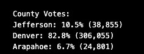

# Election Analysis

## 1. Overview of Election Audit: Explain the purpose of this election audit analysis.
A precinct in Colorado has held an election to determine their next United States congressman. The election results have been collected and we are tasked with auditing the data collected to determine the voter turnout, the total votes for each county in the precint, determine which countyh had the largest voter turnout, calculate the amount of votes each candidate received, and then determine the winner of the election in that precinct based on popular vote.

## 2. Election-Audit Results: 
   ### - How many votes were cast in this congressional election?
There were 369,711 votes cast in this congressional election for the three counties in this data collection: Denver, Arapahoe, and  Jefferson. This  data is tracked through the coding as well as confirmed in the csv file.

   ### - Provide a breakdown of the number of votes and the percentage of total votes for each county in the precinct.
From the election results, we can count that Jefferson had a voter turnout of 38,855; Denver had 306,055; and Arapahoe had 24,801. This was tracked by the amount of times the county name appeared on the election results csv provided. Taking the number of votes cast in each county and dividing it by the total voters and then multiplying the number by 100, we can see the percentage turnout for each county. From the image below, we can see Denver had the highest percentage of voter turnout at 82.8%, followed by Jefferson at 10.5% and then Arapahoe had only 6.7% of the voter turnout of the three counties.
    

      
   ### - Which county had the largest number of votes?
Denver had the largest number of votes coming in at 305,055. This was tracked using an if-then statement shown below and starts on line 118 of the code.
      

      
   ### - Provide a breakdown of the number of votes and the percentage of the total votes each candidate received.
There were 369,711 votes cast in this data set and three candidates were in the election: Charles Casper Stockham, Diana DeGette, and Raymon Anthony Doane. The votes each candidate received respecfully were 85,213; 271,892; and 11,606. This was tracked the same way the counties were tracked, using a counter to tally everytime the candiates name appeared in the candidate column. Similarly, the percentage of votes for each candiate could be calculated just like the county percentage; Taking the number of votes cast for each candidate and dividing it by the total voters and then multiplying the number by 100. From this formula, we can see the percentage turnout for each candidate. From the image below, we can see Diana DeGette had the highest percentage of votes at 73.8%, followed by Charles Casper Stockham at 23.0% and then Raymon Anthony Doane had only 3.1% of the votes.
      

   ### - Which candidate won the election, what was their vote count, and what was their percentage of the total votes?
Diana DeGette won the election with  272,892 votes. Diana collected 73.8% of the total votes cast in this election. This data was determined the same way the largest voting county was tabulated, using if-then conditionals demonstrated below and starts on line 154 of the code.
      

## 3. Election-Audit Summary: 
The script can be in other elections by making some minor changes. 
1. One can change the file_to_upload on line 9 so it links to another csv with other election results for any other county
2. One can add script to tabulate all counties winning candidate, you could then determine the winner of the state.
